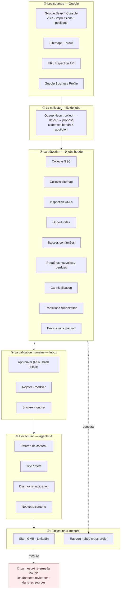
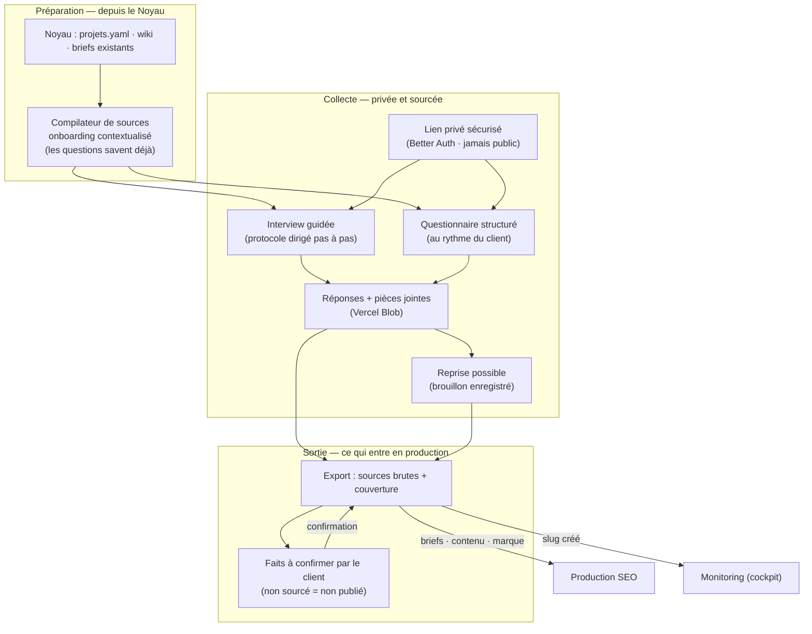
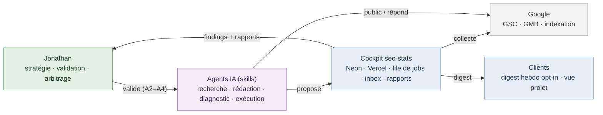
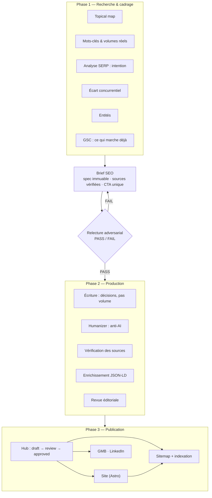
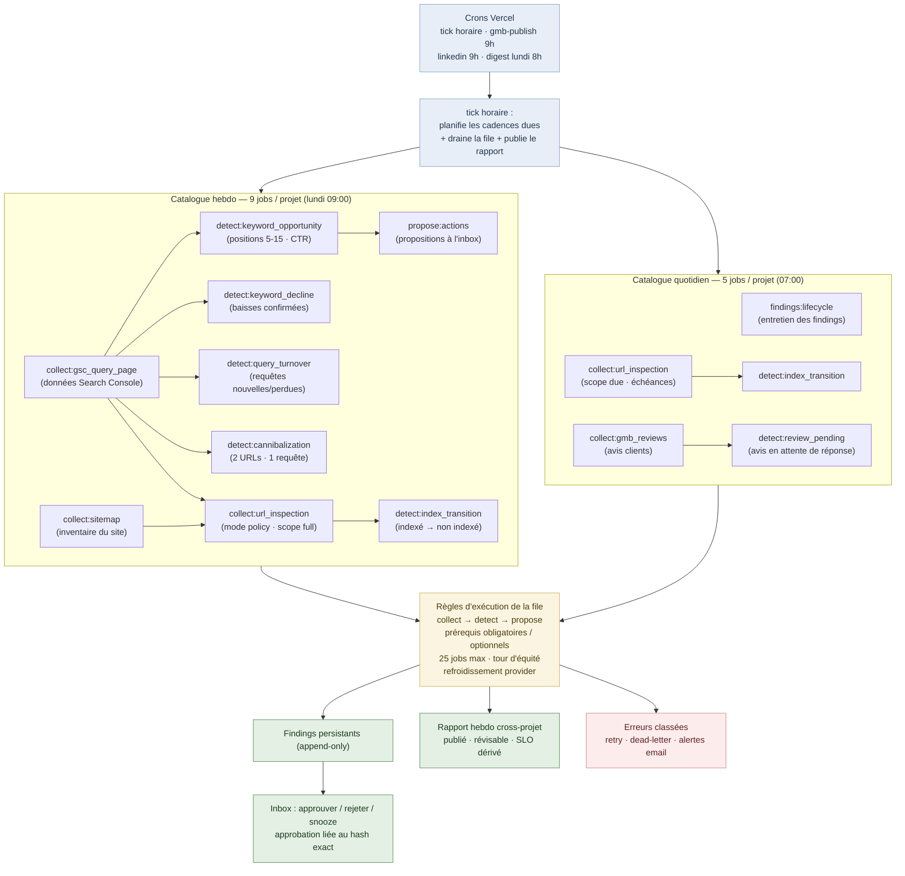
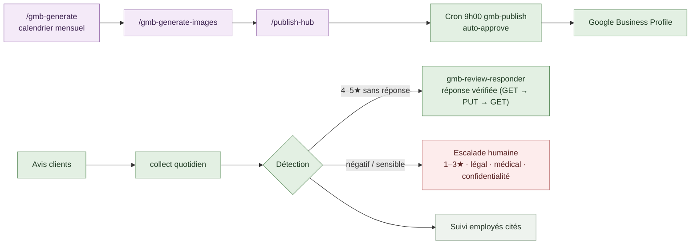
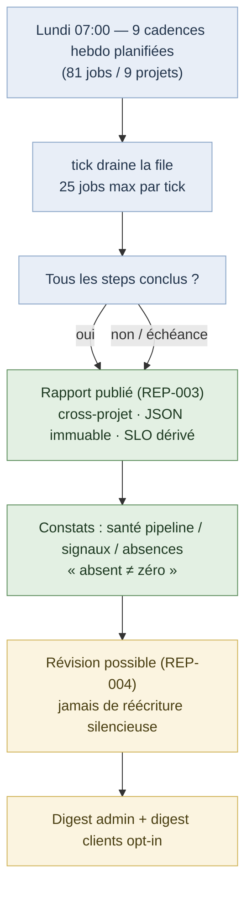
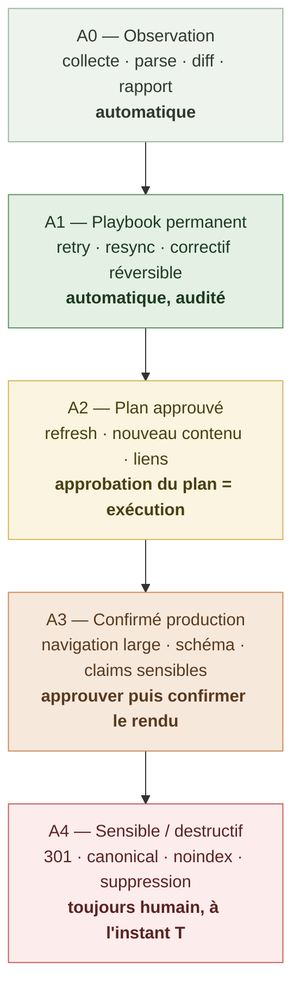
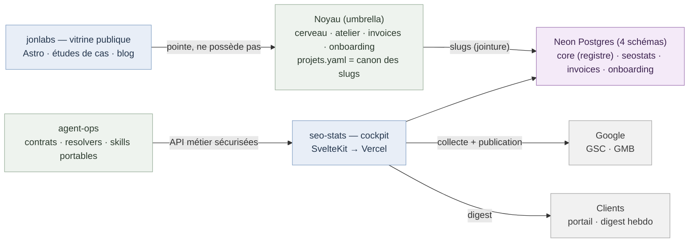
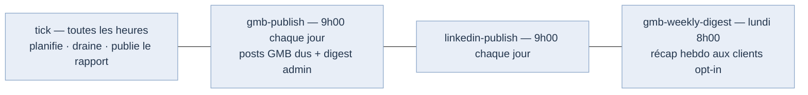

# SEO — Architecture & flux de travail (support vidéo YouTube)

> **À quoi sert ce document.** Il raconte, en scènes, comment le SEO de Jon Labs est piloté :
> un cycle fermé entre les données Google, un cockpit agentique (`seo-stats`), des agents IA
> et une validation humaine. Chaque scène = un diagramme + la narration à dire à l'écran.
>
> **Comment l'utiliser.** Le markdown se rend tel quel dans Obsidian / GitHub / mermaid.live.
> La version présentable (dark, rendue, prête à enregistrer) est générée par
> `scripts/generate-flow-html.py` → `SEO-FLOW-PROCESS.html` (ouvrir dans Chrome, zoomer, enregistrer).
> Le `.md` est la source de vérité : on édite ici, on régénère le HTML (loi n°4 : pointeurs, pas de copies).

---

## Scène 1 — La boucle en une image

Le pitch en 10 secondes : **je ne « fais pas du SEO » au feeling — je fais tourner une boucle.**
Les données Google arrivent, un cockpit les transforme en décisions, un humain valide ce qui
compte, des agents exécutent, et la mesure du lundi suivant referme la boucle.

> 📖 **Comprendre cette scène.**
> - **Google Search Console (GSC)** — Le compteur officiel de Google : qui cherche quoi, combien de fois ton site apparaît, et combien de clics il reçoit.
> - **Sitemap** — Le plan du site que tu donnes à Google : « voilà toutes mes pages ». *Pourquoi :* sans lui, Google découvre tes pages au hasard des liens.
> - **URL Inspection** — La loupe de Google : page par page, es-tu indexé ou non, et pourquoi. *Pourquoi :* le sitemap dit ce qui *devrait* être indexé, l'inspection dit ce qui l'est *réellement*.
> - **Google Business Profile (GMB)** — La fiche locale (adresse, horaires, avis) qui apparaît sur Maps et dans la recherche locale.
> - **File de jobs** — Une liste de petites tâches à faire : collecter, détecter, proposer. *Pourquoi :* Vercel n'exécute rien en continu — une fonction démarre, travaille, s'éteint. Une file découpe le travail en morceaux qui tiennent dans une seule fonction.
> - **Les 9 jobs du catalogue hebdo** — 3 collectes (données), 5 détecteurs (signaux), 1 producteur (propositions). *Pourquoi :* chaque job est petit, rejouable et traçable — on sait toujours où la chaîne en est.
> - **Inbox / validation humaine** — Les propositions arrivent dans une boîte où Jonathan décide : j'approuve, je rejette, j'ignore. *Pourquoi :* certaines actions sont destructives (supprimer, rediriger) ou coûteuses (créer du contenu) — l'IA propose, l'humain dispose.
> - **Approbation liée au hash** — On n'approuve pas « une idée », on approuve la version exacte de la proposition. *Pourquoi :* si la proposition change entre-temps, ton approbation ne vaut plus — impossible d'approuver par erreur une version modifiée.
> - **Rapport hebdo** — Le résumé de la semaine pour tous les projets. *Pourquoi :* c'est la boucle qui se ferme : on mesure l'effet des actions, et le client voit le résultat.
>
> 🎙️ **Narration (45 s).** « Tout part des sources Google : Search Console, les sitemaps,
> l'inspection d'indexation, et les fiches Google Business. Une file de jobs planifiée collecte
> ces données, puis neuf détecteurs les transforment en signaux : une position qui chute, une
> requête qui apparaît, une page qui se désindexe. Ces signaux arrivent dans une inbox où *je*
> décide — j'approuve, je rejette, je snooze. Ce que j'approuve est exécuté par des agents IA,
> publié, et la mesure de la semaine suivante revient dans la boucle. Rien n'est jeté au feeling :
> tout est un cycle. »

---

## Scène 2 — L'onboarding : le début d'un projet

Avant toute boucle SEO, il y a une collecte. Le projet naît d'un onboarding : on part de ce que
le Noyau sait déjà, on pose les questions au client dans un espace privé, et on n'exporte que
du sourcé — un fait non confirmé ne devient jamais une affirmation publiée.

> 📖 **Comprendre cette scène.**
> - **Noyau** — Le cerveau central : le registre des projets (slugs), le wiki, les briefs déjà écrits.
> - **Onboarding contextualisé** — Le questionnaire est préparé avec ce qu'on sait déjà. *Pourquoi :* le client ne doit pas répéter ce qu'on connaît — des questions intelligentes donnent de meilleures réponses.
> - **Interview guidée** — Un entretien pas à pas, mené à l'écran. Pour les clients qui préfèrent être accompagnés.
> - **Questionnaire structuré** — Le même contenu, en libre-service, au rythme du client.
> - **Lien privé sécurisé** — Chaque client a son espace, protégé par connexion. *Pourquoi :* confidentialité par construction — les réponses ne sont jamais publiques, jamais dans le savoir partagé.
> - **Pièces jointes (Blob)** — Le client dépose ses documents (factures, plans, photos) directement dans sa session.
> - **Reprise possible** — Le brouillon est enregistré, on continue plus tard. *Pourquoi :* une interview ne se fait pas toujours d'une traite.
> - **Export des sources + couverture** — En sortie : les sources brutes et ce qu'elles couvrent. *Pourquoi :* la production ne travaille que sur du sourcé.
> - **Faits à confirmer** — La liste de ce que le client doit valider. *Pourquoi :* un fait non confirmé par une source fiable ne devient jamais une affirmation publiée.
>
> 🎙️ **Narration (45 s).** « Et comment naît un projet ? Tout commence par l'onboarding.
> Avant toute production, je prépare la collecte depuis le Noyau : le registre des slugs, ce
> qu'on sait déjà, les briefs existants — tout cela compile un onboarding *contextualisé* :
> les questions savent déjà ce que je connais. Le client reçoit un lien privé et sécurisé, et
> choisit son mode : une interview guidée, pas à pas, ou un questionnaire structuré, à son
> rythme. Il peut reprendre sa session, déposer des pièces jointes. Les réponses sont privées
> par construction — elles ne montent jamais dans le savoir partagé. En sortie : un export des
> sources brutes et de leur couverture, et surtout la liste des faits que le client doit
> confirmer — parce qu'un fait non sourcé ne devient jamais une affirmation publiée. C'est ce
> socle qui alimente ensuite les briefs, la production, et le suivi dans le cockpit. »

---

## Scène 3 — Les acteurs

Qui fait quoi. C'est la scène qui pose le décor : il y a un humain, des agents, un cockpit, et Google.

> 📖 **Comprendre cette scène.**
> - **Slug** — L'identifiant unique d'un projet (ex. `barberconcept`). *Pourquoi :* une seule identité par projet partout — factures, SEO, contenu se rejoignent par le même fil.
> - **Agents IA (skills)** — Des programmes spécialisés qui font chacun un métier : chercher, rédiger, diagnostiquer, publier.
> - **Cockpit seo-stats** — L'app qui collecte, détecte, propose et archive : la mémoire opérationnelle de tout le SEO.
> - **Digest hebdo client** — Le résumé que reçoit le client chaque semaine. *Pourquoi :* le client voit le résultat sans ouvrir l'app — la mécanique reste interne.
>
> 🎙️ **Narration (30 s).** « Le système a quatre acteurs. Moi : la stratégie et le droit de
> veto sur ce qui compte. Les agents IA : l'exécution — ils cherchent, rédigent, diagnostiquent.
> Le cockpit : la mémoire opérationnelle, une base Neon sur Vercel qui collecte, détecte et
> archive tout. Et Google, qui fournit les données et reçoit les publications. Les clients,
> eux, reçoivent un digest hebdomadaire — ils voient le résultat, pas la mécanique. »

---

## Scène 4 — Production de contenu : du brief au publié

Comment un article naît. C'est la scène « vitrine » : montrer la rigueur éditoriale.

> 📖 **Comprendre cette scène.**
> - **Topical map** — La carte des sujets que le site doit couvrir, organisés par thème et par importance.
> - **Analyse SERP** — Regarder ce que Google affiche déjà pour une requête. *Pourquoi :* pour viser l'intention réelle, pas celle qu'on imagine.
> - **Brief SEO / spec immuable** — Le contrat de l'article : sujet, intention, CTA unique, sources, liens internes, longueur. *Pourquoi :* tout le monde (agents, relecteurs) travaille sur la même cible, et on peut vérifier qu'aucun élément n'a été perdu en route.
> - **Relecture adversarial** — Un agent dont le métier est de *casser* le brief : trouver l'intention floue, la différenciation nulle, les sources faibles. *Pourquoi :* casser un brief coûte deux minutes, réécrire un article raté coûte deux heures — autant détecter la faiblesse avant d'écrire.
> - **Écriture : décisions, pas volume** — Chaque section répond à une décision que le lecteur vient prendre (choisir, comparer, agir) au lieu de remplir des paragraphes. *Pourquoi :* Google récompense les pages qui répondent vite, et le lecteur part si la réponse est enterrée — un article n'est pas jugé au nombre de mots.
> - **Humanizer (anti-AI)** — La passe qui enlève les tics d'écriture machine : triplets, transitions génériques, emphase artificielle. *Pourquoi :* le contenu doit sonner humain — c'est la voix de Jon, pas celle d'un modèle.
> - **Sources vérifiées** — Chaque affirmation sensible est ouverte et vérifiée (HTTP 200 ne suffit pas : on vérifie que la page dit bien ce qu'on affirme). *Pourquoi :* une fausse info publiée = crédibilité perdue et risque de désaveu.
> - **Enrichissement JSON-LD** — Des données structurées que Google comprend (Article, FAQ, horaires). *Pourquoi :* ça aide Google à comprendre la page et parfois à l'afficher plus richement.
> - **Hub : draft → review → approved** — Le contenu passe par des statuts avant publication. *Pourquoi :* rien ne part sans validation — sauf le canal GMB, calibré pour l'auto-approbation.
>
> 🎙️ **Narration (40 s).** « Un article ne part jamais d'une intuition. Phase 1 : recherche —
> topical map, volumes réels, analyse de la SERP, écart concurrentiel, et surtout ce que mes
> propres données GSC montrent déjà. Tout converge dans un brief : une spec immuable avec
> sources vérifiées et un seul appel à l'action. Le brief passe devant un relecteur adversarial
> — un agent dont le métier est de le casser. S'il échoue, on recommence ; s'il passe, la
> production peut commencer : écriture orientée décision, passage humanizer pour enlever
> l'odeur d'IA, vérification des sources, enrichissement JSON-LD, revue éditoriale. Puis le
> contenu entre dans le hub, suit un workflow draft → review → approved, et part sur le site,
> le sitemap, et les canaux sociaux. »

---

## Scène 5 — Monitoring : le cockpit qui ne dort jamais

Le cœur technique. La file de jobs, les cadences, les détecteurs, l'inbox.

> 📖 **Comprendre cette scène.**
> - **Tick horaire** — Une fonction qui se réveille toutes les heures pour faire avancer la file. *Pourquoi :* Vercel ne fait tourner aucun processus en continu — le tick est le réveil qui planifie, draine et publie.
> - **Catalogue hebdo (9 jobs)** — Le travail de la semaine, par projet : 3 collectes, 5 détecteurs, 1 producteur de propositions.
> - **Catalogue quotidien (5 jobs)** — Le travail de chaque jour, par projet : l'entretien des findings, l'inspection des URLs dues, la collecte des avis, et deux détections (transitions d'indexation, avis en attente).
> - **25 jobs max par tick** — Un tick ne prend que 25 tâches. *Pourquoi :* chaque tick vit dans une fonction limitée en temps (elle meurt après ~5 minutes) — plafonner garantit qu'un tick finit toujours son travail et que la file avance régulièrement.
> - **Tour d'équité** — Les gros projets ne prennent pas tout le tick. *Pourquoi :* sans ça, un projet chargé ferait attendre les autres indéfiniment.
> - **Refroidissement provider** — Quand Google dit « quota épuisé », toute la cohorte attend avant de réessayer. *Pourquoi :* réessayer en boucle un quota épuisé ne fait qu'épuiser le quota plus vite.
> - **Dépendances collect → detect → propose** — Une détection ne part pas avant sa collecte, une proposition pas avant sa détection. *Pourquoi :* détecter sur des données périmées fabriquerait de faux signaux — et si la collecte meurt, le run le dit (`partial`) au lieu de faire semblant.
> - **Findings persistants** — Chaque signal est écrit en base, horodaté, avec ses preuves. *Pourquoi :* on garde l'historique — une absence de preuve ne devient jamais « tout va bien ».
> - **Erreurs classées** — `retry` (réessaie plus tard) ou `dead-letter` (ne réessaie jamais). *Pourquoi :* un quota épuisé et un bug ne se traitent pas pareil — sans classement, on boucle sur des erreurs sans fin.
> - **Absent ≠ zéro** — Un pipeline en panne n'est pas « 0 problème ». *Pourquoi :* sans cette règle, le projet dont la collecte est morte passerait pour le plus sain du portefeuille.
>
> 🎙️ **Narration (50 s).** « La surveillance est un système, pas une habitude. Des crons sur
> Vercel font tourner la machine : un tick horaire qui planifie les cadences dues, draine la
> file de jobs, et publie le rapport quand tout est terminé. Chaque projet a un catalogue de
> neuf détections hebdomadaires : positions, sitemaps, inspection d'indexation, opportunités,
> baisses, requêtes nouvelles ou perdues, cannibalisation, transitions d'indexation, et
> génération de propositions. Les jobs ont des dépendances, des plafonds, un tour d'équité pour
> qu'un gros projet ne mange pas tout. Tout ce qui est détecté devient un finding persistant —
> une preuve horodatée — puis une proposition dans l'inbox. Moi, je tranche. Et si un job
> meurt, l'erreur est classée : retry, dead-letter, ou alerte email directe. »

---

## Scène 6 — Présence locale : Google Business en pilote automatique

L'autre pilier : les fiches GMB, les posts, les avis. Montre l'automatisation + l'escalade humaine.

> 📖 **Comprendre cette scène.**
> - **Auto-approve** — Les posts GMB passent directement en « approved ». *Pourquoi :* un post de fiche locale est peu risqué et daté (calendrier) — le valider un par un n'apporte rien, à condition de bien calibrer le calendrier en amont.
> - **Réponse vérifiée en 3 temps** — L'agent relit l'avis distant, écrit sa réponse, puis relit pour vérifier qu'elle est bien en ligne. *Pourquoi :* impossible d'écraser une réponse publiée entre-temps — et il faut prouver que la réponse est réellement partie.
> - **Escalade humaine** — Un avis 1–3★ ou sensible (légal, médical, confidentialité) monte vers Jonathan. *Pourquoi :* l'IA ne doit pas répondre à l'aveugle sur des sujets à risque — l'automatisation s'arrête où la confiance s'arrête.
> - **Suivi des employés cités** — Les avis qui mentionnent un employé sont comptés et agrégés par mois. *Pourquoi :* la qualité de service se mesure aussi dans les données — utile au client pour piloter ses équipes.
>
> 🎙️ **Narration (40 s).** « La présence locale tourne sur deux rails. Le premier : la
> publication. Un agent génère un calendrier mensuel de posts par établissement, avec images,
> et le pousse dans le hub — en auto-approbation — puis un cron les publie sur Google à 9h00.
> Le second rail, c'est les avis. Chaque nuit, les avis sont collectés et analysés. Un avis
> 4–5 étoiles sans réponse est traité par un agent qui répond, avec une vérification en trois
> temps : il relit l'avis distant avant d'écrire, il écrit, il relit après pour vérifier.
> Mais un avis négatif, ou qui touche au légal ou à la santé — ça ne s'automatise pas : ça
> monte directement vers moi. Le bon réflexe, c'est de savoir ce qu'on n'automatise pas. »

---

## Scène 7 — Le rapport hebdo : la boucle se referme

Le livrable visible : un rapport cross-projet, publié, révisable, avec un SLO.

> 📖 **Comprendre cette scène.**
> - **81 jobs / 9 projets** — 9 entrées de catalogue × 9 projets. *Pourquoi :* le rapport n'est publié que quand tout est conclu (ou à l'échéance) — sinon il dirait des demi-vérités.
> - **SLO dérivé** — La ponctualité se calcule depuis la première publication, jamais déclarée. *Pourquoi :* une colonne « ponctuel : oui » pourrait mentir ; un calcul, non.
> - **Révision tracée** — On ne corrige pas le rapport en silence : on publie une révision avec une raison. *Pourquoi :* un rapport publié est un artefact — le corriger sans trace détruirait la confiance dans les archives.
>
> 🎙️ **Narration (35 s).** « Chaque lundi, le cycle produit un artefact : le rapport
> hebdomadaire. Les neuf projets sont planifiés, la file est drainée, et quand tout est
> conclu — ou à l'échéance — le rapport est publié. C'est un document cross-projet, stocké en
> JSON immuable, dont la ponctualité se dérive, jamais ne se déclare. Il dit la santé du
> pipeline et la santé des signaux, et il distingue soigneusement « rien à signaler » de
> « pas encore mesuré » — une distinction qui change tout. Et si une donnée était fausse ? On
> ne réécrit pas le rapport en silence : on publie une révision, tracée, avec une raison. »

---

## Scène 8 — Gouvernance : ce que l'IA peut faire seule, et ce qu'elle ne peut pas

La scène de confiance : le modèle d'approbation A0–A4.

> 📖 **Comprendre cette scène.**
> - **A0 — Observation** — Collecter, lire, comparer, rapporter : aucun risque. *Pourquoi :* lire ne casse rien — autant l'automatiser à 100 %.
> - **A1 — Playbook permanent** — Retenter, resynchroniser, corriger une erreur réversible : automatique mais audité. *Pourquoi :* ce sont des gestes sans conséquence, mais on garde la trace.
> - **A2 — Plan approuvé** — Approuver un plan précis autorise son exécution. *Pourquoi :* demander deux fois la même validation est du bruit — l'approbation porte sur un périmètre exact, l'agent s'y tient.
> - **A3 — Confirmé production** — Changements larges (navigation, schémas, claims sensibles) : on approuve le plan, puis on confirme le rendu final. *Pourquoi :* un détail visuel peut tout changer — l'œil humain reste le dernier juge.
> - **A4 — Sensible / destructif** — 301, canonical, noindex, suppression : toujours un humain à l'instant T. *Pourquoi :* ce sont des gestes irréversibles — l'IA propose, l'humain dispose, et seulement au moment de l'action.
>
> 🎙️ **Narration (35 s).** « La vraie question de l'IA en SEO, c'est la gouvernance. J'ai un
> barème à cinq niveaux. Observer, collecter, rapporter : 100 % automatique. Les playbooks
> permanents — retenter, resynchroniser, corriger une erreur réversible : automatiques, mais
> audités. Un plan approuvé — rafraîchir un article, en créer un : une seule approbation
> autorise l'exécution, tant que le diff reste dans le périmètre validé. Les changements
> sensibles — navigation, schémas, affirmations : approbation puis confirmation du rendu
> final. Et les actions destructives — un 301, un noindex, une suppression : toujours un
> humain, au moment où ça se fait. L'automatisation s'arrête exactement là où la confiance
> s'arrête. »

---

## Scène 9 — Où vivent les données

L'infrastructure en une image : le Noyau, Neon, Vercel, Google, la vitrine.

> 📖 **Comprendre cette scène.**
> - **Neon partagé, 4 schémas** — Une seule base physique, mais chaque app possède son schéma (`core`, `seostats`, `invoices`, `onboarding`). *Pourquoi :* les données restent souveraines (chaque app migre son schéma comme elle veut) tout en permettant la jointure par slug.
> - **API métier, jamais SQL** — Les agents ne touchent jamais la base directement : ils passent par des API sécurisées. *Pourquoi :* pas de credentials SQL chez les agents — chaque écriture est auditable, idempotente, et ne peut pas casser la base.
> - **La vitrine ne possède rien** — `jonlabs` rend et pointe, il ne stocke aucune donnée client. *Pourquoi :* séparation des responsabilités — un site public ne peut pas fuiter une donnée qu'il ne possède pas.
>
> 🎙️ **Narration (40 s).** « Pour finir, l'architecture des données. Tout part du Noyau — mes
> six partitions souveraines : le cerveau, l'atelier de contenu, les factures, l'onboarding —
> reliées par un registre de slugs unique. Le cockpit lit et écrit dans une base Neon
> partagée, où chaque schéma appartient à son application. Les agents ne touchent jamais la
> base directement : ils passent par des API métier sécurisées, idempotentes et auditées —
> les seules frontières d'écriture. Le site public, lui, ne possède aucune donnée : il rend
> et il pointe. Chaque brique est souveraine, et tout est cousu par le même fil : le slug. »

---

## Annexe — Les crons (la machine dans le temps)

> 📖 **Comprendre cette scène.**
> - **tick horaire** — Le seul chemin par lequel la file avance en production. *Pourquoi :* rejouer un tick, redémarrer ou rattraper un créneau manqué est la même opération — idempotent par créneau local.
> - **Crons à 9h00** — La publication GMB et LinkedIn se font le matin, en heure métier. *Pourquoi :* les créneaux sont posés hors des heures de bascule d'heure d'été/hiver — un créneau quotidien ne doit jamais tomber dans le trou de mars.
> - **Digest du lundi 8h00** — Le récap de la semaine part avant le début de la journée. *Pourquoi :* le client démarre sa semaine avec le résultat, pas avec une attente.

## Annexe — Chiffres clés du système (à jour de la dernière revue)

| Paramètre | Valeur |
|---|---|
| Projets suivis | 9 |
| Détecteurs hebdo par projet | 9 entrées de catalogue (~81 jobs / run) |
| Jobs max par tick | 25 (tour d'équité, plafonds par projet / provider) |
| Rapport hebdo | cross-projet, publié, révisable, SLO dérivé de la 1ʳᵉ publication |
| Avis GMB | collecte quotidienne, réponse vérifiée en 3 temps, escalade humaine 1–3★ |
| Base | Neon Postgres, 4 schémas (core · seostats · invoices · onboarding) |
| Règle d'or | « absent ≠ zéro » : un pipeline mort ne se lit jamais « tout va bien » |

> ⚠️ Chiffres opérationnels (pas des KPI clients) : ils évoluent avec le backlog
> (`seo-stats/docs/BACKLOG.md`). Les KPI, eux, vivent dans l'app — jamais recopiés ici (loi n°4).
